# BookHub
> The application has been designed as an online service for a book library using WebAPI. 

 

## Table of contents
* [General info](#general-info)
* [Features](#features)
* [Technologies](#technologies)
* [Inspiration](#inspiration)
* [Contact](#contact)

## General info
The main feature of the application is browsing the collection of approx. 5800 books which is a live representation of WebAPI from polish website https://wolnelektury.pl/. The API contains information about books' titles, authors, literary kinds, genres, availability of audio versions and url addresses for covers and thumbnail images. All the data is in polish, that is why a web user interface has been created also entirely in that language. Thanks to the use of Bootstrap's component library, the web user interface is completely responsive.

## Features

- ### User authentication and authorization
> Access to individual functionalities depends on the user's authorization. The application has three levels of authorization: 
guest, user and administrator.
The Google Oauth Authentication system has been added to the application. If the user already exists in the database, he is logged into 
his account. Otherwise he is added to the database. 
Logging in verifies the user's authorization level and grants him access to individual functionalities.

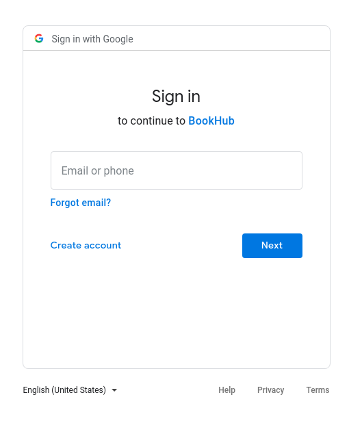 
_________________
> Guest user's menu

 
_________________

> Logged in user's menu

 
_________________

> Administrator's panel menu

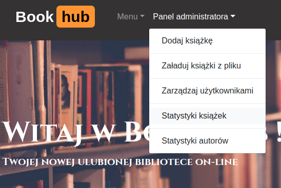 

- ### Browsing the list of books
> User of any level of authorization is able to browse the whole collection of books. The list of books is divided into pages of 20 titles on each using a pagination feature. While hoovering over the rows of the list, books' thumbnail images pop up. 

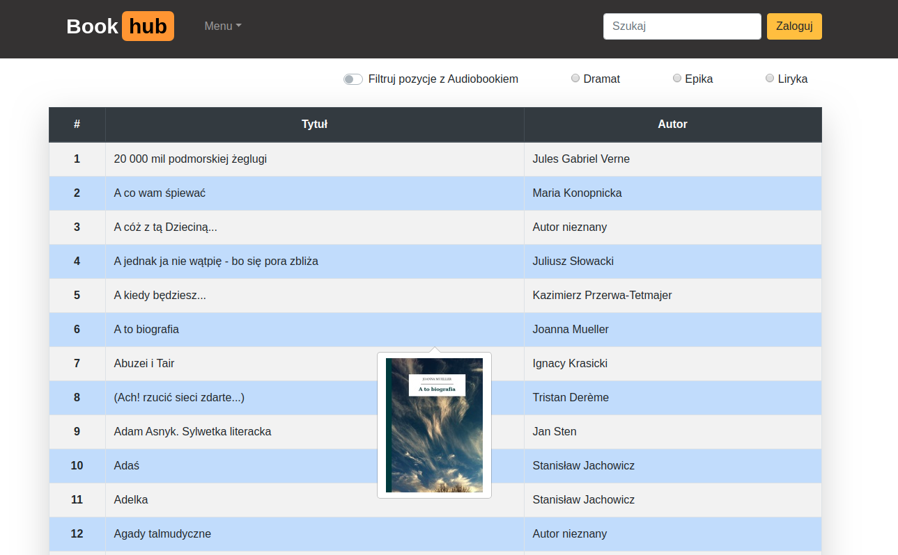 
_________________

> Pagination

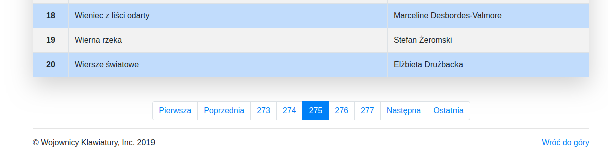 

- ### Searching the books
> On every page, located in the navbar is a box with a live-search function. While typing in either a title or an author's name, a list of books matching the given words pop up. Minimum three characters must be given in the search box. By clicking on a title displayed on the popped up list, a user is redirected to corresponding book's page. 

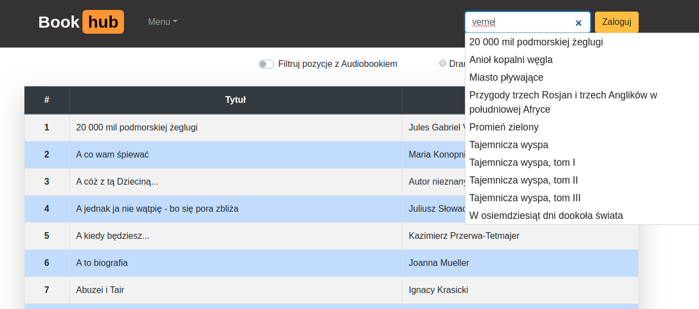 

- ### Filtering the list of books 
> The list of books can be filtered for a specific literary kind and the availability of audio version.

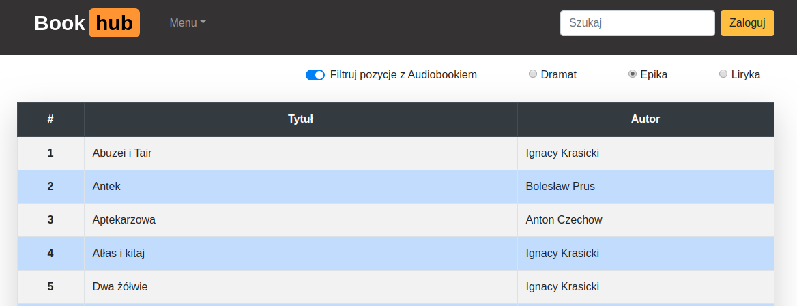 

- ### Displaying a single book view
> By clicking on any title on the list, a user is redirected to the site where more details about the book and a cover image are displayed.

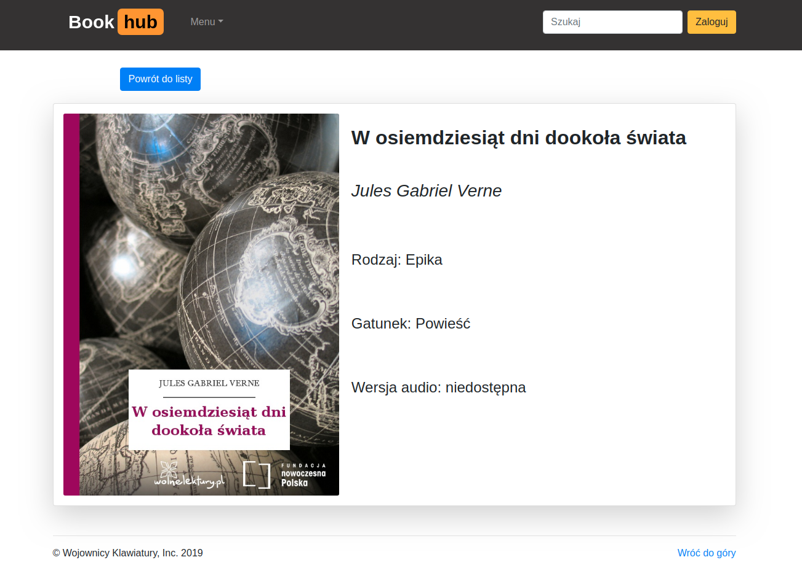 

- ### Making reservations for the books
> Any logged in registered user can make reservations for the books he is interested in by going to the single book view and clicking the corresponding button. In case the book is not available for reservation at the moment, the user sees the appropriate message. After making a reservation, a confirmation email is sent to the user. From a drop-down menu a user can go to the page where a list of his current reservations is displayed. Any reservation on that list can be canceled.

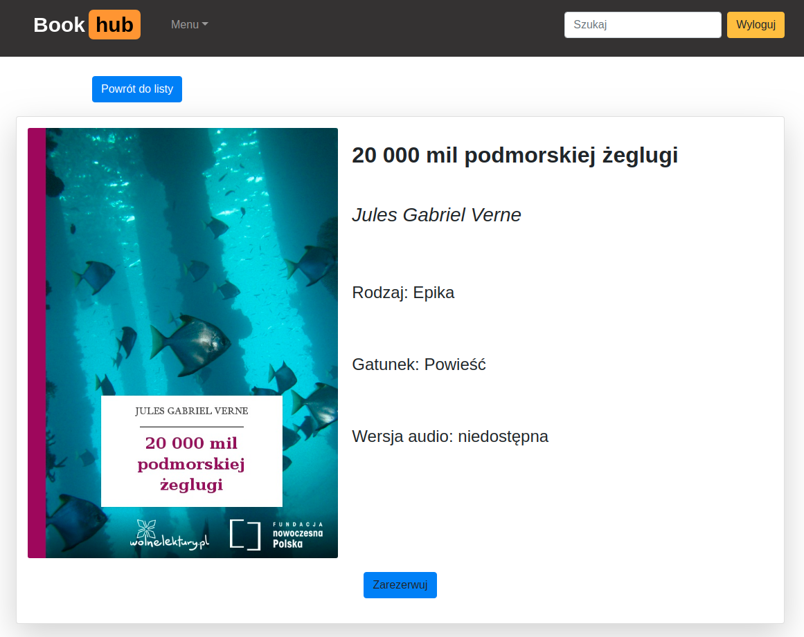 
_________________

> List of user's reservations

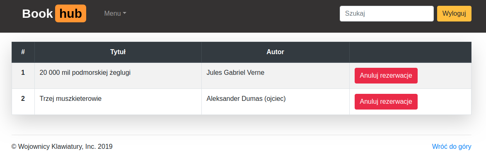 

- ### Loading data from JSON file
> In the administrator's management panel there is a functionality that allows to read all the books' data from a JSON file. All data is stored in MySQL database after loading. This functionality has been implemented as an alternative to retrieving data directly from the WebAPI in case it is not responding.

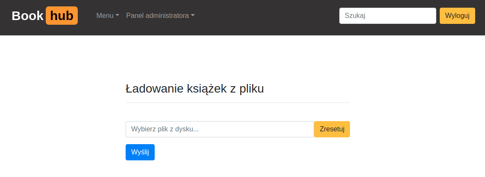 
_________________

> After sending a file, user gets a message whether the upload was successful or not.

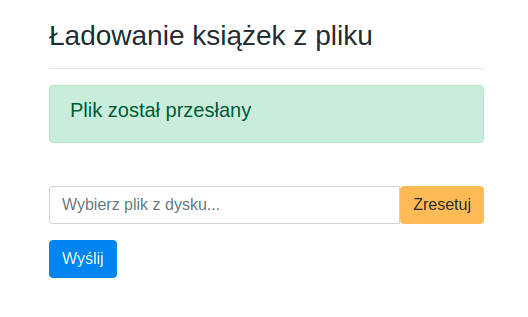 

- ### Adding a new book to the library
> A user with administrator privileges has access to a form through which all the necessary data to create a new book in the database can be added. That also includes the possibility to upload an image that will be displayed as book's cover.

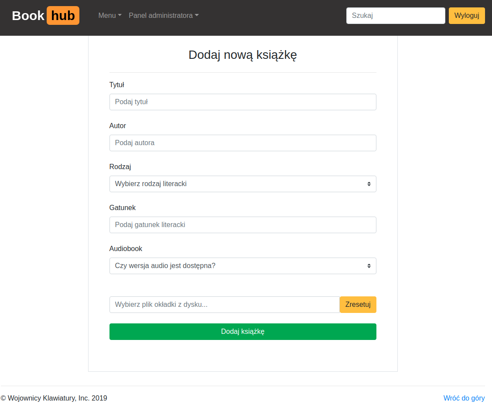 
_________________

> Added book

 
 
- ### Editing book's data
> The administrator is able to edit data for any book he chooses. The form can be accessed through single book view page. Any changed data is saved in the database.

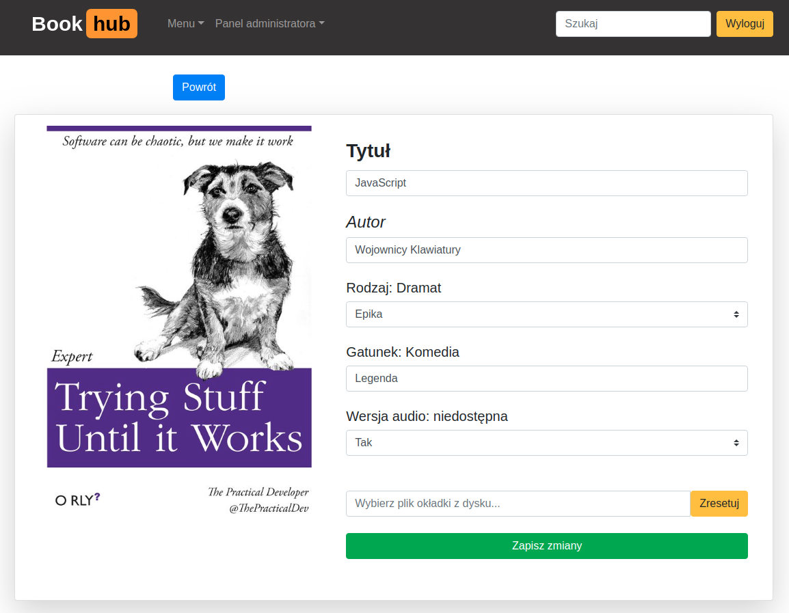 
_________________

> Updated book

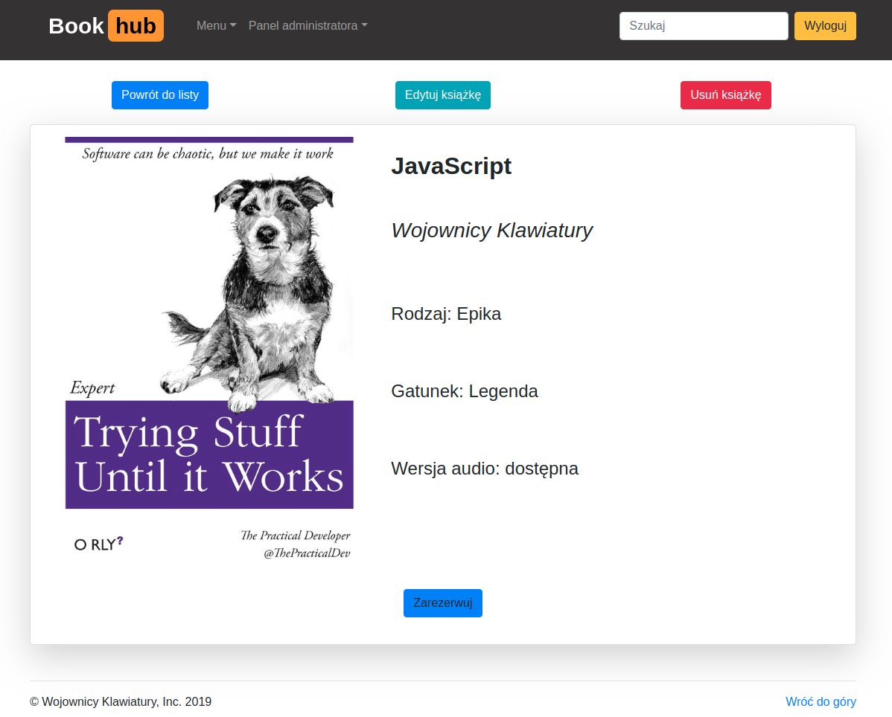 

- ### Deleting book from the database
> Any book's record can be deleted from the database by the administrator by clicking the appropriate button on the single book view page.

- ### User management
> The administrator has access to the panel where he can grant or revoke administrator rights to any registered user.

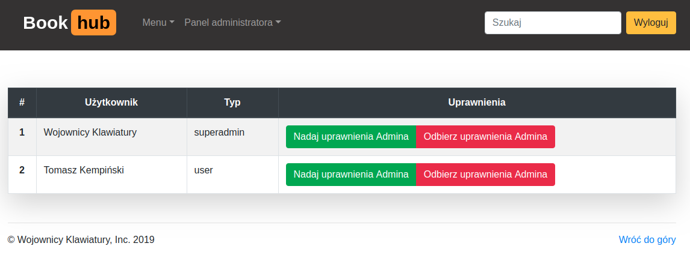 

- ### Statistics
> The administrator can view the statistics pages. In the tables he can see information on the number of borrowings for a given title or author.

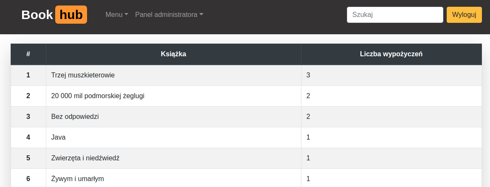 

## Technologies
* Java SE 12
* Java EE 8
* MySQL 8.0.15
* Hibernate ORM 5.4.2
* Hibernate Validator 6.0.17
* FasterXML/Jackson 2.9.10
* REST API
* Docker
* Wildfly 17.0.1
* Maven 3.3.9
* Jenkins CI/CD
* ECMAScript 6
* OAuth 2.0
* SLF4J 1.7.28
* Freemarker 2.3.29
* Bootstrap 4.3.1
* HTML5, CSS3, JS
* jQuery, AJAX

## Inspiration
The project has been created during a Java course at infoShare Academy in Gdańsk.

## Contact
Created by a course team Wojownicy-Klawiatury, 2019.

Wojownicy-Klawiatury are:

[@Tomasz Kempiński](https://github.com/tomasz-kempinski)

[@Mikołąj Krawczak](https://github.com/Mikolaj-Kr)

[@Robert Lis](https://github.com/RobertLis0023)
